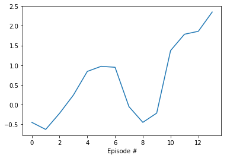

# Project 3: Collaboration and Competition

### Introduction

This is the impelementation of Udacity Deep Reinforcement Learning Nanodegree](https://www.udacity.com/course/deep-reinforcement-learning-nanodegree--nd893) Collaboration and Competition project. 

For the environment we use the [Unity ML Agents](https://github.com/Unity-Technologies/ml-agents/blob/master/docs/Learning-Environment-Examples.md#tennis) Tennis environment.

The main idea is to teach to agents to play tennis using Multi Agent Reinforcement.

## The environment

In the Tennis environment, two agents control rackets to bounce a ball over a net. If an agent hits the ball over the net, it receives a reward of +0.1. If an agent lets a ball hit the ground or hits the ball out of bounds, it receives a reward of -0.01. Each agent shall keep the ball in play.

The observation space consists of 8 variables corresponding to the position and velocity of the ball and racket. Each agent receives its own, local observation. Two continuous actions are available, corresponding to movement toward (or away from) the net, and jumping.

The image above depicts the environment.

### Reward

| event                                                        | reward  |
|--------------------------------------------------------------|:-------:|
| agent hitting ball over net.                                 | +0.1    |
| agent let ball hit their ground, or hit ball out of bounds   |  -0.01  |

### State space

24-dimensional np-array.

### Actions

2 different continuous actions, corresponding to movement toward net or away from net, and jumping.

### Solution

Average score of +0.5 over 100 consecutive episodes (after taking the maximum over both agents).

## Network architecture

The models are created at model.py, and in this project define by the following architectures:

    Actor network:
      input_dim: 24 (state size)
      hidden_1_size: 512
      activation_1: relu
      hidden_2_size: 256
      activation_2: relu
      output_dim: 2 (action size)

    Critic network:
      input_dim: 33 (state size)
      hidden_1_size: 514 (512 + action size)
      activation_1: relu
      hidden_2_size: 256
      activation_2: relu
      output_dim: 1

  note that the output of Critic network is a contiuous value, corresponding to the q-target.
  On hidden layer 1 we concatenate the actions, as is suggested in [Continuous control with deep reinforcement learning](https://arxiv.org/abs/1509.02971).

## Agent

The agent class is in `agent.py`, wich mediates the interaction between the environment and the model.  

As we are using experience replay. We have a buffer to store te past episodes and rewards. The parameters for agent are:

| param        | vaule    | description 
|--------------|----------|--------------------------------------
|BUFFER_SIZE   | int(1e6) | replay buffer size
|BATCH_SIZE    | 512      | minibatch size
|GAMMA         | 0.99     | discount factor
|TAU           | 1e-3     | for soft update of target parameters
|LR for actor  | 1e-4     | learning rate for the actor
|LR for critc  | 3e-4     | learning rate for the critc

## Training

Actor Critic methods are composed of four networks. The two main networks are the Actor and the Critic, the other two are copies of them, used to apply Fixed Q-Targets, like DQN method. Differently from this last one, Deep Deterministic Policy Gradient (DDPG) are efficient to deal with continuous space.

As on DQN, we have the learning and sampling steps.

* *Learning step*: The Actor networks learn which action take, or which contiuous value for each action, given a state. On the other hand, the Critic network receives the action taken by the Actor and the states to generete de expected q-value for it. So the Critic evaluates the state value function using TD estimate, calculates the Advantage Function and use this value to train the Actor, in the way that the Actor's goal is to maximize the Critic q-value.

* *Sampling step*:  the algorithm chooses an action A from a state s using a policy, observes the reward and next state and stores it on a buffer memory. On learning step we use this buffer to select samples of past episodes to compute its expected Q-values.

The DDPG algorithm is written bellow:

To proceed with fixed Q-targets we use soft-updating, copying an amount of the local weights to the target weights. This update is given by:

θ_target = τ*θ_local + (1 - τ)*θ_target

To work with a multi agent approach it was created a MultiAgent object that manages each agent and shares the replay buffer memory beteween them.

## Results 

The following graph shows the results of the training run. Every blue dot in the graph represents the score of an
episode (drawn above the index of the episode). 

The problem was really solved at after episode 1357.

The weights learned during this run are saved in the files checkpoint_actor.pth and checkpoint_critic.pth.

## Future Works

For future works I would like to implement [AC3](https://arxiv.org/abs/1602.01783), and [D4PG](https://arxiv.org/abs/1804.08617), that uses multiple parallel copies of the same agent to distribute the task of generating experiences.

One other approach should be using Prioritized Experience Replay to avoid the cases where rare but important experiences could be missed or not so much used during learning.